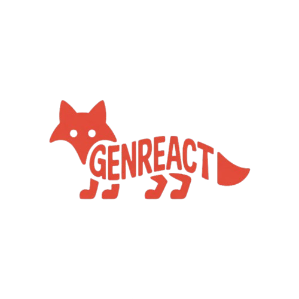
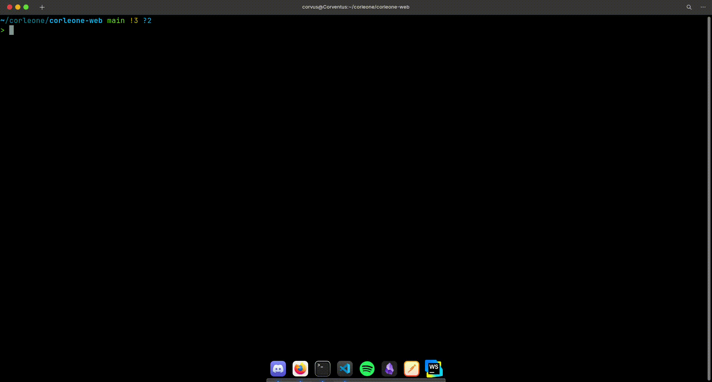
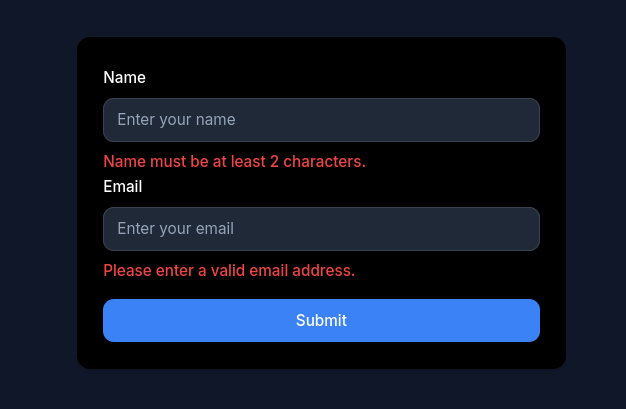

<p align="center">
  <a href="#">
    
  </a>
</p>

<p align="center">
  
  
  
  
  
  <a href="https://discord.gg/W9rattDP7h" target="_blank">
    
  </a>
  <a href="https://rasperon.dev" target="_blank">
    
  </a>
</p>

#

# ⚛️ GENREACT

> **Your AI-Powered React Component Generator — Built for speed, control, and flexibility.**

> **Powered by GENCREATE API and prompt chaining. Generate clean, production-ready components directly from CLI.**

> Create. Edit. Deploy. _No fluff, just code._

---

### 🔗 Links
- 🌐 [Website](https://rasperon.dev)
- 📦 [NPM](https://npmjs.com/package/genreact)
- 💬 [Discord](https://discord.gg/W9rattDP7h)
- 🛠️ [Docs](https://rasperon.dev/genreact-docs)
- 🧠 [Powered by Gencreate](https://discord.gg/W9rattDP7h)
---

## 📦 Installation

```bash
npm install -g genreact
```

---

## ⚙️ Usage (CLI)

```bash
genreact
```
## EXAMPLE
<p align="center">
  <a href="#">
    
  </a>
</p>

## OUTPUT
## EXAMPLE
<p align="center">
  <a href="#">
    
  </a>
</p>

> Generates a fully typed, styled, and animated React component in your current folder.


---

## 🧪 Features

- 🔄 Gencreate-powered prompt chaining
- 🎨 Tailwind CSS + shadcn/ui support
- ⚛️ Functional & typed components
- 🧱 Atomic structure output (optional)
- 🛜 Offline capabilities (cached prompt templates)
- 🌍 Multi-language support (EN/TR)

---

## 🧠 Prompt Chain Feature

GenReact doesn’t just generate code — it **understands your needs**.

1. It comprehends what you're asking for.
2. It suggests the best component structure.
3. It includes CSS classes and interactivity.
4. It outputs everything into your file.

Without you needing to manually define styles, GenReact behaves like an AI-powered assistant that **knows what it’s doing**.

---

## 🔒 Roadmap

- [ ] UI-based component management (genreact-ui)
- [ ] Next.js and Astro compatibility mode
- [ ] Plugin system (e.g., auth, modal, etc.)
- [ ] Online component marketplace

---

## 🙌 Contributing

Every PR is appreciated. Our focus is on code quality, simplicity, and speed. Feel free to contribute by opening issues or submitting pull requests.

---

## 📞 Contact & Support

[🌐 rasperon.dev](https://rasperon.dev)  
[💬 Discord server](https://discord.gg/W9rattDP7h)

---

**Made with ❤️‍🔥 by Rasperon C.**

<p align="center">
  
</p>
